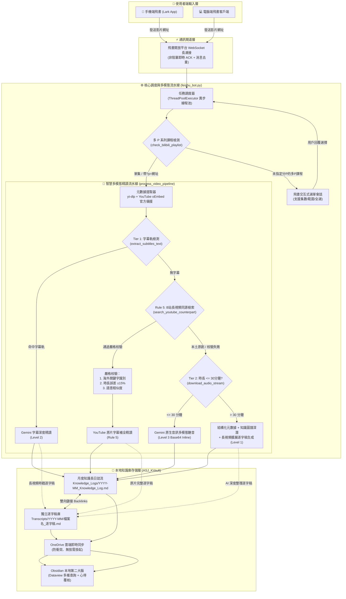
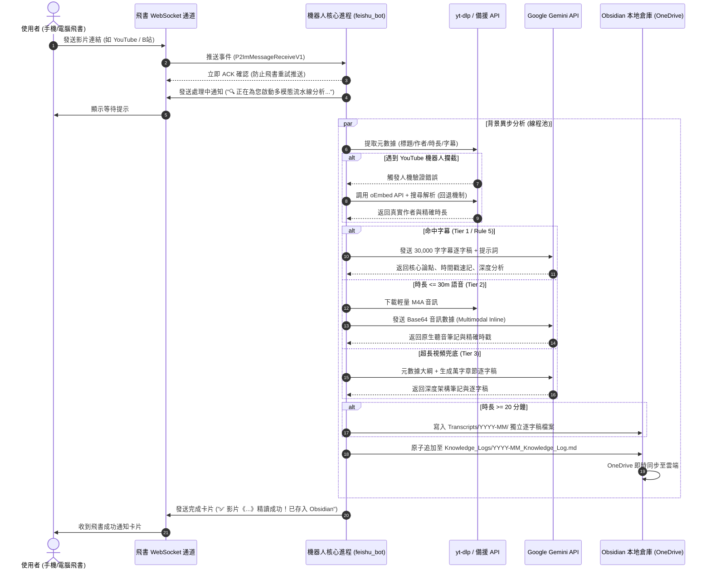

# 🧠 Feishu-Obsidian Multimodal Knowledge Pipeline
### 飛書 × Gemini × Obsidian 智慧多模態影片知識庫與第二大腦自動化中樞

[](LICENSE)
[](https://www.python.org/)
[](https://obsidian.md/)
[](https://ai.google.dev/)
[](https://open.feishu.cn/)

---

## 📖 專案概述 (Overview)

在資訊爆炸的時代，高質量的深度長視頻（如大學公開課、前沿學術訪談、萬字技術分享）是構建個人知識體系的核心資訊源。然而，手動記錄視頻筆記繁瑣耗時，而移動端零碎收集又容易陷入「收藏即遺忘」的困境。

**Feishu-Obsidian Multimodal Knowledge Pipeline** 是一套專為 **Obsidian 本地知識庫**、**OneDrive 雲同步防衝突架構** 與 **飛書（Lark）即時移動端交互** 設計的端到端 AI 多模態影片精讀與第二大腦自動化歸檔系統：

1. **隨時隨地，發送即歸檔**：在手機或電腦飛書私聊直接發送 YouTube 或 Bilibili 影片連結，系統全自動在背景排隊解析，完成後即時回傳確認卡片；
2. **三級動態多模態流水線 (Multimodal Tiering)**：字幕軌優先精讀 -> 原生音訊多模態直接「聽音」-> 結構化元數據與領域知識圖譜兜底，榨取最高資訊密度；
3. **海外轉載同源反向檢索 (Rule 5 Cross-Platform Sync)**：自動識別 B 站轉載的海外演講（如 Stanford, MIT, Lex Fridman, TED），透過嚴格時長與語意校驗反向尋找 YouTube 原片並補全原生字幕；
4. **長視頻獨立逐字稿歸檔 (Rule 3 Long Video Transcripts)**：超過 20 分鐘的長視頻自動在 `Transcripts/` 目錄生成去口語化、章節段落化、附帶時戳的繁體中文獨立逐字稿，並與月度日誌建立雙向鏈接（Backlinks）；
5. **B 站多 P 系列課程互動式選講**：自動偵測多集系列課程，在飛書中生成交互選單，支援「單集 (P2)」、「區間 (1-3)」、「全量 (All)」自由調度；
6. **生產級健壯性**：智能分流代理（Gemini 與外網抓取走代理，飛書長連接直連）、原生支援 `cookies.txt` 繞過 YouTube 機器人驗證、YouTube 官方 oEmbed API 免驗證元數據備援。

---

## 🏗️ 系統架構圖 (Architecture Diagrams)

### 1. 全局系統分層架構 (High-Level Architecture)



---

### 2. 智慧多模態決策決策樹 (Multimodal Decision Tree)

```mermaid
flowchart TD
    Start([收到影片網址]) --> ExtractMeta[抓取元數據: 標題 / 頻道 / 時長]
    ExtractMeta --> CheckPlatform{影片平台判斷}
    
    CheckPlatform -->|YouTube| FetchYtSub[提取官方/自動字幕軌]
    CheckPlatform -->|Bilibili| FetchBiliSub[提取 B站字幕軌]
    
    FetchYtSub --> SubFound{是否有有效字幕?}
    FetchBiliSub --> SubFound
    
    SubFound -->|是| PromptTier1[啟動 Level 2: 字幕逐字稿深度精讀]
    SubFound -->|否 (B站)| CheckForeign{是否具備海外轉載特徵?<br/>Stanford, MIT, TED, 雙語...}
    SubFound -->|否 (YouTube)| CheckDuration
    
    CheckForeign -->|是| SearchYT[在 YouTube 反向檢索候選影片]
    CheckForeign -->|否: 判定為本土原創| CheckDuration{時長 <= 30分鐘?}
    
    SearchYT --> VerifyMatch{候選影片時長誤差 <= 15%?}
    VerifyMatch -->|通過| FetchYTOriginalSub[獲取 YouTube 原片字幕]
    VerifyMatch -->|未通過| CheckDuration
    
    FetchYTOriginalSub --> HasOrigSub{原片是否有字幕?}
    HasOrigSub -->|是| PromptRule5[啟動 Rule 5: 跨平台同源字幕補全精讀]
    HasOrigSub -->|否| CheckDuration
    
    CheckDuration -->|是| DownloadAudio[抽取輕量 M4A 音訊流]
    CheckDuration -->|否| PromptTier3[啟動 Level 1: 結構化元數據精讀]
    
    DownloadAudio --> GeminiAudio[Gemini Flash 原生多模態聽音解析]
    GeminiAudio --> PromptTier2[啟動 Level 3: 語音多模態精讀]
    
    PromptTier1 --> CheckLong{時長 >= 20 分鐘?}
    PromptRule5 --> CheckLong
    PromptTier2 --> CheckLong
    PromptTier3 --> GenDeepTrans[調用 Gemini 擴展生成章節詳細逐字稿] --> CheckLong
    
    CheckLong -->|是| SaveTranscript[寫入 Transcripts/YYYY-MM/ 獨立逐字稿檔案]
    CheckLong -->|否| SaveMonthly[原子追加寫入月度長日誌流]
    
    SaveTranscript --> SaveMonthly
    SaveMonthly --> ReplyFeishu[回傳飛書卡片: 成功通知 + 雙鏈路徑]
    ReplyFeishu --> Done([流程結束])
```

---

### 3. 即時通訊生命週期時序圖 (Message Sequence Flow)



---

## 🌟 核心特色 (Key Features)

### 1. 雙軌存儲機制與防同步風暴
- **月度長流聚合**（`Knowledge_Logs/YYYY-MM_Knowledge_Log.md`）：所有知識型影片按月度線性追加，嚴禁為單個影片創建孤立零散小檔案，從根本上杜絕 OneDrive 的大量小檔案同步衝突與索引風暴。
- **長視頻獨立歸檔**（`Transcripts/YYYY-MM/`）：影片時長 $\ge 20$ 分鐘時，自動將萬字逐字稿與深度段落單獨存為檔案，並於月度日誌中建立雙向鏈接（`📄 [[Transcripts/...|查看逐字稿]]`）。

### 2. Rule 5 跨平台 YouTube 同源原片反向關聯
- B 站常有優質海外講座（如史丹佛 CS 課程、MIT 公開課、TED、Lex Fridman 訪談），但多數缺乏官方字幕；
- 機器人自動提取主題關鍵詞，透過代理至 YouTube 檢索英文原片；
- **嚴格雙重校驗**：具備海外特徵關鍵詞識別 + 候選影片時長誤差 $\le \pm 15\%$ 校驗，嚴禁將中國本土原創演講（如 Kaggle 競賽經驗）誤關聯至無關海外影片。

### 3. 多 P 系列課程智慧選集交互
- 當使用者發送包含數十講的 B 站播放清單（未帶 `?p=`）時，機器人不會無腦只抓第一集；
- 自動抓取清單總時長與章節預覽，向飛書發送友善選單；
- 使用者可直接私聊回覆：「`2`」、「`1-3`」、「`全部`」或「`取消`」，機器人自動解析並批次依序處理。

### 4. 企業級反爬與代理容錯
- **智慧分流**：Gemini API 請求走代理，飛書 WebSocket 長連接直連國內伺服器；
- **YouTube 人機驗證免疫**：代碼原生支援載入庫根目錄的 `cookies.txt`；若無憑證，自動透過官方免登入 oEmbed API 與搜尋解析補全頻道作者與精確時長，永不中斷。

---

## 📂 目錄結構規範 (Directory Layout)

```
ASJ_KVault/
├── Knowledge_Logs/                 # 時政與科技知識月度長日誌 (由機器人自動按月建立)
│   └── 2026-09_Knowledge_Log.md
├── Transcripts/                    # 長視頻獨立逐字稿庫 (Rule 3 獨立歸檔)
│   └── 2026-09/
│       ├── 2026-09-10_史丹佛講座..._逐字稿.md
│       └── 2026-09-18_梅强对话Steve_Li..._逐字稿.md
├── Classical_Music/                # 古典音樂作品庫 (按作曲家/作品實體聚合)
│   └── J.S.Bach/
│       └── BWV988_Goldberg_Variations.md
├── Dashboards/                     # 系統導航儀表盤與 Dataview 索引
│   ├── Library_Index.md
│   └── System_Rules.md             # 知識庫規範與 AI 生成標準文檔
├── _Templates/                     # Obsidian 範本 (Templates)
│   ├── Knowledge_Monthly_Template.md
│   ├── Knowledge_Video_Entry_Template.md
│   └── Classical_Work_Template.md
├── Scripts/                        # 自動化服務與腳本核心
│   ├── feishu_bot.py               # 飛書多模態影片機器人主服務
│   ├── append_video_entry.py       # 本地 CLI 手動追加工具
│   ├── start_feishu_bot.bat        # Windows 背景啟動腳本
│   ├── stop_feishu_bot.bat         # Windows 停止腳本
│   └── start_feishu_bot.ps1        # PowerShell 啟動腳本
├── .env.example                    # 環境變數範本 (開源範本，嚴禁提交真實金鑰)
├── .gitignore                      # 嚴格排除 .env, cookies.txt, 臨時音訊與個人筆記
├── LICENSE                         # MIT 開源授權協議
└── README.md                       # 專案架構與使用手冊
```

---

## 🚀 快速上手 (Quick Start)

### 1. 克隆倉庫與環境準備

推薦使用極速套件管理器 [uv](https://github.com/astral-sh/uv) 或標準 `pip`：

```bash
# 克隆倉庫
git clone https://github.com/your-username/Feishu-Obsidian-Multimodal-Pipeline.git
cd Feishu-Obsidian-Multimodal-Pipeline

# 建立並啟用 Python 虛擬環境 (Python 3.10+)
uv venv
.venv\Scripts\activate   # Windows
# source .venv/bin/activate  # Linux / macOS

# 安裝核心依賴
uv pip install lark-oapi yt-dlp requests python-dotenv
```

### 2. 配置環境變數 (`.env`)

複製 `.env.example` 為 `.env`：

```bash
cp .env.example .env
```

在 `.env` 中填入您的憑證：

```ini
# 飛書開放平台 (https://open.feishu.cn/)
FEISHU_APP_ID=cli_xxxxxxxxxxxx
FEISHU_APP_SECRET=xxxxxxxxxxxxxxxxxxxxxxxx

# Google AI Studio (https://aistudio.google.com/)
GEMINI_API_KEY=AIzaxxxxxxxxxxxxxxxxxxxxxxxx

# 本地網路代理 (若需要存取 YouTube 與 Gemini API)
HTTP_PROXY=http://127.0.0.1:7890
HTTPS_PROXY=http://127.0.0.1:7890
NO_PROXY=127.0.0.1,localhost,*.feishu.cn,*.larksuite.com
```

### 3. 配置 YouTube Cookies（可選但強烈推薦）

為徹底避免 YouTube 在代理環境下彈出 `Sign in to confirm you're not a bot` 警告：
1. 在 Chrome / Edge 瀏覽器安裝擴充套件（如 **Get cookies.txt LOCALLY**）；
2. 打開 YouTube 並確認已登入，點擊擴充套件按鈕並導出為 `cookies.txt`；
3. 將該檔案直接放置於倉庫根目錄：`ASJ_KVault/cookies.txt`（已被 `.gitignore` 嚴格忽略，絕對不會外洩）。

### 4. 飛書開放平台權限設定

1. 登入 [飛書開放平台](https://open.feishu.cn/) 建立「企業自建應用」；
2. 在「憑證與基礎資訊」中獲取 `App ID` 與 `App Secret`；
3. 在「開發配置 -> 事件與回調」中：
   - 選擇 **長連接 (WebSocket)** 模式（無需配置公網 IP 或公網網域名稱！）；
   - 添加事件：`im.message.receive_v1`（接收訊息 v2.0）；
4. 在「權限管理」中開通：
   - `im:message`（獲取與發送單聊、群聊訊息）；
   - `im:message:send_as_bot`（以機器人身份發送訊息）；
5. 建立並發布應用版本。

### 5. 啟動服務

#### 方式 A：直接終端執行
```bash
python Scripts/feishu_bot.py
```

#### 方式 B：Windows 背景靜默守護
雙擊 `Scripts/start_feishu_bot.bat` 即可在背景啟動服務，隨時可雙擊 `Scripts/stop_feishu_bot.bat` 安全關閉。

---

## 📱 使用示範 (Usage)

啟動後，在手機或電腦飛書上找到您建立的機器人：

1. **常規單影片**：
   - 私聊發送：`https://www.youtube.com/watch?v=...` 或 `https://www.bilibili.com/video/BV...`
   - 機器人將自動進行多模態深度精讀，5~20 秒內自動將繁體中文精讀條目寫入 Obsidian，並回傳完成卡片。
2. **多 P 系列課程**：
   - 私聊發送包含數十講的清單連結；
   - 機器人自動列出總時長與章節，提示您回覆集數（如「`1-3`」）；
   - 回覆後機器人自動在背景依序併發精讀並入庫！

---

## 📄 開源授權 (License)

本專案採用 [MIT License](LICENSE) 開源授權，歡迎自由客製化、擴展與貢獻！
